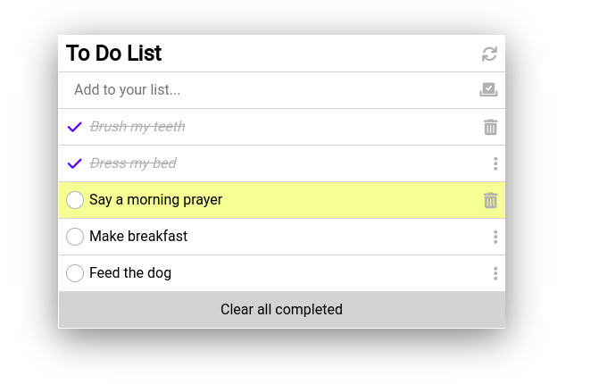

# To Do List Application

> "To-Do-List App" is a simple web app that displays a list of daily tasks and allows you to edit, add and remove task from that list.

## Built With (Linter)

- Webpack
- HTML (Webhint)
- CSS (Stylelint)
- JavaScript (Eslint)

## Prerequisites
The following applications are required to be installed for the project to run!
- Modern browser e.g [Google Chrome](https://www.google.com/chrome/), [Edge](https://www.microsoft.com/en-us/edge?r=1), [Firefox](https://www.mozilla.org/en-US/exp/firefox/new/) etc.
- [Git](https://git-scm.com/downloads)
- [Node.js](https://nodejs.org/en/download/) LTS version

## App Setup
- Clone [this](https://github.com/PraisesPJMT/To-Do-List) GitHub repository using `git clone git@github.com:PraisesPJMT/To-Do-List.git`
- Initialize the package manager using `npm init -y`
- Download all required modules using `npm install` inside the project directory (/To-Do-List)
- Launch project on browser using `npm run start` inside the project directory (/To-Do-List)

## App Deployment
To-Do-List application can be deployed on any web server that can host a Node.js runtime environment

The project was successfully deployed to GitHub Pages. The live project can be
viewed at the following links:  
[To-Do-List App](https://praisespjmt.github.io/To-Do-List/)  
URL Link: [https://praisespjmt.github.io/To-Do-List/](https://praisespjmt.github.io/To-Do-List/)

## Authors

👤 **Praises Tula**

- GitHub: [@praisespjmt](https://github.com/PraisesPJMT)
- Twitter: [@praisespjmt](https://twitter.com/PraisesPJMT)
- LinkedIn: [Praises Musa Tula](https://www.linkedin.com/in/praises-tula-9233aa76)

## 🤝 Contributing

Contributions, [issues](https://github.com/PraisesPJMT/To-Do-List/issues), and feature requests are welcome!

## ⭐️ Show your support

Give a ⭐️ if you like this project!

